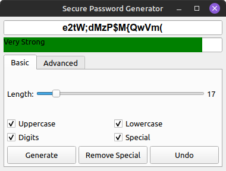

# passwordgen

A fast and secure password generator




## Features

- Generate strong, cryptographically secure passwords
- Customizable character sets (uppercase, lowercase, digits, special characters)
- Visual password strength meter
- Option to avoid similar-looking characters (1, l, I, 0, O)
- Auto-clearing clipboard for enhanced security
- Password history with undo functionality
- Mouse wheel scrolling through password history (middle mouse-down over the password shows the recent history for review and selection)
- Setup autosaved, defaults can be recalled
- Compact, user-friendly interface


## Requirements

- Qt 5.12+ or Qt 6.0+
- C++17 compatible compiler
- CMake or qmake build system

## Building the Application

### Using qmake

1. The main code is `main.cpp`
2. The project file is `passwordgen.pro`:
   ```
   QT += core gui widgets
   
   TARGET = passwordgenerator
   TEMPLATE = app
   
   SOURCES += main.cpp
   CONFIG += c++17
   ```
3. Build the application:
   ```bash
   qmake passwordgen.pro
   make
   ```

### Using CMake

1. Save the code to `main.cpp`
2. Create a `CMakeLists.txt` file:
   ```cmake
   cmake_minimum_required(VERSION 3.10)
   project(PasswordGenerator)
   
   set(CMAKE_CXX_STANDARD 17)
   set(CMAKE_AUTOMOC ON)
   set(CMAKE_AUTORCC ON)
   set(CMAKE_AUTOUIC ON)
   
   find_package(Qt6 COMPONENTS Core Gui Widgets REQUIRED)
   # For Qt5, use: find_package(Qt5 COMPONENTS Core Gui Widgets REQUIRED)
   
   add_executable(passwordgenerator main.cpp)
   target_link_libraries(passwordgenerator Qt6::Core Qt6::Gui Qt6::Widgets)
   # For Qt5, use: target_link_libraries(passwordgenerator Qt5::Core Qt5::Gui Qt5::Widgets)
   ```
3. Build the application:
   ```bash
   mkdir build
   cd build
   cmake ..
   make
   ```

## Usage

1. Adjust password length using the slider
2. Select character sets to include
3. Click "Generate" to create a new password
4. Password is automatically copied to clipboard
5. Use mouse wheel over the password field to browse history
6. Middle-click to view full password history


## Security Notes

- All passwords are generated using cryptographically secure random number generation
  (This is NOT to say that even the longest, most difficult, cautious password cannot be cracked. They are, after all, just ASCII characters strewn together. However, the likelihood of a long, encrypted, mixed case password with special characters is exponentially more difficult for a hacker to discover. (Check the 'docs' for more information)
- No passwords are stored permanently
- Memory containing passwords is securely cleared when no longer needed
- Optional clipboard auto-clearing after 30 seconds
